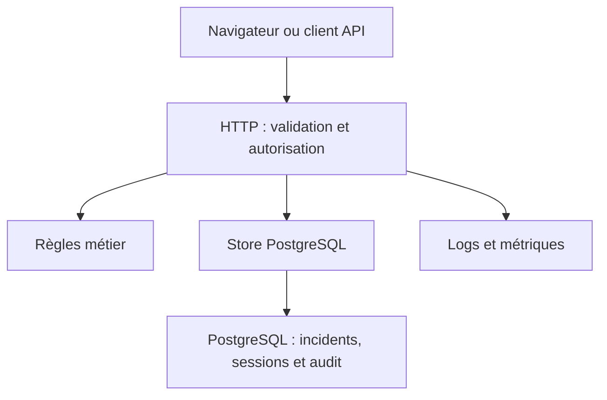

# Architecture

Le domaine n’importe ni Fastify ni PostgreSQL. `Store` permet de tester les comportements HTTP sans base ; les tests PostgreSQL vérifient séparément transactions, contraintes et concurrence. Un monolithe évite la complexité distribuée qui ne serait pas justifiée par ce périmètre.

Une mutation prend un verrou sur la ligne, compare la version transmise, vérifie la transition, puis écrit l’état et l’événement dans la même transaction. Un conflit renvoie 409 : le client doit recharger et décider, sans relance automatique aveugle.

L’interface web utilise du JavaScript natif et `textContent`, aucun HTML injecté à partir des données. React n’apporterait pas assez de valeur pour ce petit périmètre ; le projet met l’accent sur le backend et l’exploitation.

La pagination par offset est bornée et triée avec un identifiant de départage. Elle suffit ici ; elle n’offre pas une vue figée sous insertions concurrentes. Une pagination par curseur serait préférable à grande échelle.
