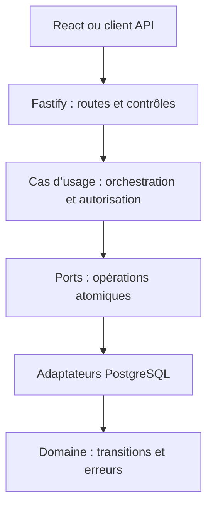
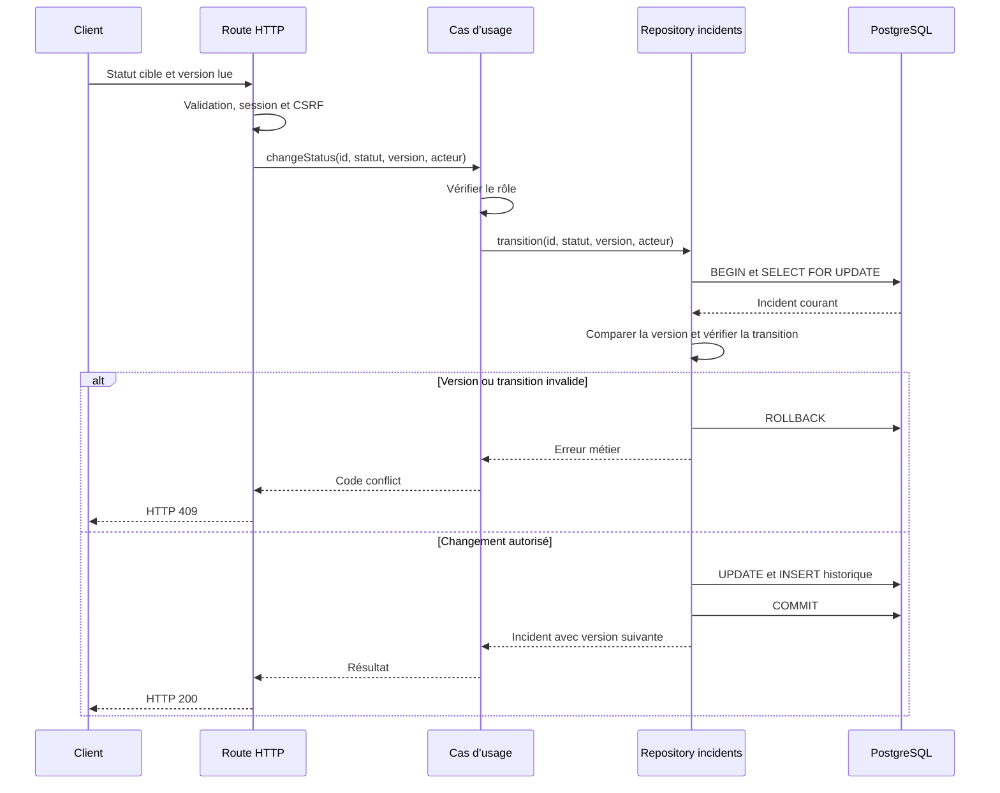
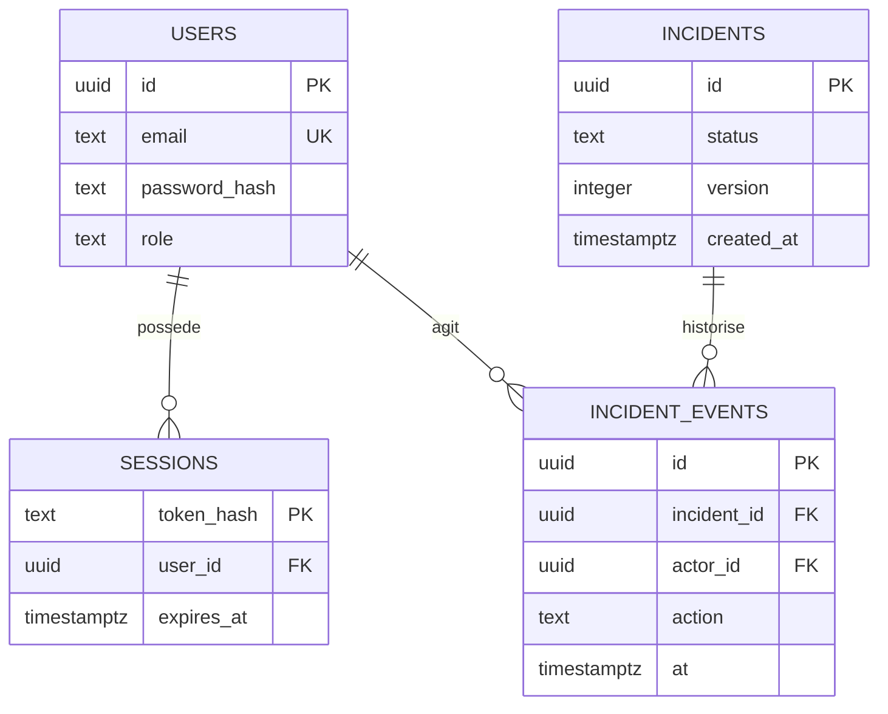

# Architecture d’Incident Desk

Ce guide décrit les frontières du code, les flux et les invariants à préserver lors des évolutions.

## 1. Périmètre et objectifs

Incident Desk est une application pour une équipe unique : déclarer des incidents, modifier leur statut et consulter l’historique. Elle sert aussi de démonstration de développement backend, de concurrence et d’exploitation.

Les objectifs architecturaux sont :

- préserver la cohérence entre un incident et son historique ;
- empêcher un utilisateur de modifier ce que son rôle ne permet pas ;
- rendre les erreurs et conflits explicites ;
- garder un lancement local reproductible et des contrôles automatisés ;
- permettre des évolutions sans imposer une infrastructure distribuée.

Le système n’isole pas plusieurs organisations. Tous les utilisateurs authentifiés accèdent aux mêmes incidents. Il ne fournit pas encore de notifications, de SSO, de pièces jointes ou de traitement asynchrone.

## 2. Vue d’ensemble

L’application est un **monolithe modulaire** : un serveur Fastify expose l’API et sert le bundle React sur la même origine. PostgreSQL conserve les données et les sessions. Aucun service de messages ni cache partagé n’est nécessaire au fonctionnement local.

Les flèches représentent le flux d’exécution. Les cas d’usage dépendent des ports ; les adaptateurs PostgreSQL les implémentent. Le contrôle de transition reste exécuté dans la transaction, après acquisition du verrou.

React n’accède jamais à PostgreSQL. Les contrôles côté interface servent à guider l’utilisateur ; le serveur reste responsable de la validation et de l’autorisation.

## 3. Responsabilités et fichiers

| Partie        | Responsabilité                                                      | Point d’entrée                               |
| ------------- | ------------------------------------------------------------------- | -------------------------------------------- |
| Présentation  | Formulaires, liste et historique par fonctionnalité                 | `src/client/features/`, `src/client/App.tsx` |
| État client   | Restauration/expiration, pagination et actualisation après écriture | `src/client/use-workspace.ts`                |
| Client HTTP   | Appels JSON et erreurs HTTP typées                                  | `src/client/api.ts`                          |
| Contrat HTTP  | Schémas TypeBox et types DTO inférés                                | `src/shared/contracts.ts`                    |
| Assemblage    | Construction des cas d’usage, injection des ports et plugins        | `src/server/app.ts`, `src/server/main.ts`    |
| Transport     | Validation, authentification, CSRF, conversion des DTO et erreurs   | `src/server/routes/`, `src/server/errors.ts` |
| Application   | Autorisation des écritures et orchestration des incidents           | `src/server/application/incidents.ts`        |
| Ports         | Contrats incidents, sessions et disponibilité                       | `src/server/application/ports.ts`            |
| Domaine       | Modèle, transitions et erreurs indépendantes de HTTP                | `src/server/domain/models.ts`                |
| Persistance   | SQL, sessions, verrous et transactions                              | `src/server/persistence/`                    |
| Observabilité | Compteurs et latence par modèle de route                            | `src/server/observability.ts`                |
| Migrations    | Schéma versionné et checksum                                        | `scripts/migrate.ts`, `migrations/`          |

`main.ts` construit un pool partagé par trois adaptateurs distincts : incidents, sessions et sondes. `buildApp` reçoit leurs interfaces. Les tests injectent un stockage mémoire ; les cas d’usage peuvent être testés sans Fastify ni PostgreSQL.

Le client utilise exclusivement les DTO de `shared/contracts.ts`. Les mappers sélectionnent les champs publics et normalisent les dates en ISO ; les schémas de réponse renforcent cette frontière. Les types DTO sont dérivés des schémas utilisés pour la validation Fastify et la génération d’OpenAPI. Le modèle métier reste interne au serveur.

ESLint interdit les imports serveur depuis le client ou les contrats partagés, ainsi que les dépendances transport/infrastructure depuis le domaine et l’application. Les adaptations s’effectuent au démarrage, pas dans les cas d’usage.

## 4. Lecture et écriture d’un incident

### Lecture

La route valide les paramètres, authentifie la session et appelle le cas d’usage de lecture qui utilise le port incidents. Le tri de la liste utilise `created_at DESC, id DESC`, avec `limit` et `offset` bornés. Le départage par identifiant rend le tri déterministe, mais la pagination ne garantit pas une vue figée si de nouveaux incidents apparaissent entre deux pages.

### Changement de statut

Le client transmet l’identifiant, le statut cible et la version qu’il a lue. Le cas d’usage vérifie le rôle puis délègue à une opération atomique du repository incidents.

Invariants à préserver :

1. Un changement enregistré possède son événement d’historique.
2. Un échec de l’historique annule aussi le changement de l’incident.
3. Une version périmée ne peut pas écraser une modification concurrente.
4. Une transition vers le même statut ou hors du graphe autorisé est refusée.

L’isolation PostgreSQL par défaut est `READ COMMITTED`. Le verrou de ligne sérialise les changements d’un même incident ; la comparaison de version permet d’identifier un client devenu obsolète après l’attente du verrou. Le client doit recharger et décider après un 409, plutôt que remplacer silencieusement sa version et réessayer.

La création est également transactionnelle : incident et événement `created` sont enregistrés ensemble. Elle n’est pas encore idempotente : deux POST peuvent créer deux incidents.

## 5. Modèle de données

Le diagramme expose les colonnes structurantes, pas l’intégralité du schéma. Les contraintes SQL contrôlent notamment rôles, statuts, sévérités, version positive et clés étrangères. Voir la [migration initiale](../migrations/001_initial.sql).

`schema_migrations` conserve le nom, le checksum et la date d’application de chaque migration. Un verrou consultatif PostgreSQL empêche deux processus de migration d’appliquer simultanément le schéma. Une migration déjà appliquée doit rester inchangée ; l’évolution passe par une nouvelle migration.

## 6. Frontières de sécurité

- **Identité** : mots de passe dérivés avec scrypt et sel aléatoire ; tokens de session aléatoires dont seule l’empreinte est stockée en base.
- **Session** : expiration fixe de huit heures et révocation à la déconnexion. Cookie HttpOnly/SameSite Strict pour le navigateur, Bearer pour les clients API.
- **Autorisation** : `reader` consulte ; `operator` et `admin` modifient ; les métriques nécessitent `admin`.
- **HTTP** : validation des entrées, refus des propriétés inconnues, limite du corps, limitation de débit et headers de sécurité.
- **CSRF** : header personnalisé sur les mutations authentifiées par cookie, complété par SameSite et l’absence de CORS ouvert.
- **Données** : SQL paramétré ; erreurs internes génériques ; headers sensibles expurgés des logs.

Le cookie `Secure` doit être activé en production derrière HTTPS. Les paramètres locaux HTTP et ceux de production doivent rester explicites. Le rôle PostgreSQL de démonstration n’est pas une séparation complète des privilèges : en production, distinguer l’utilisateur des migrations et celui de l’application.

L’historique est transactionnel mais n’est pas une preuve inviolable : un administrateur de base peut le modifier. Un besoin de conformité nécessiterait une conservation protégée supplémentaire. Voir le [modèle de menace](../SECURITY.md).

## 7. Build, déploiement et exploitation

| Contexte         | Fonctionnement                                                                      | Limite à connaître                                                    |
| ---------------- | ----------------------------------------------------------------------------------- | --------------------------------------------------------------------- |
| Développement    | Serveur TypeScript surveillé ; esbuild surveille le bundle React                    | Pas de garantie de rechargement automatique du navigateur             |
| Build            | TypeScript compile serveur et domaine dans `dist` ; esbuild produit `public/assets` | Types DTO inférés des schémas, sans génération de fichier             |
| Docker local     | PostgreSQL, tâche de migration puis application ; volume persistant                 | Identifiants locaux exclusivement destinés au développement           |
| Image            | Build multiétage, dépendances runtime et utilisateur non-root                       | Construire l’image ne prouve pas un parcours navigateur réussi        |
| AWS de référence | ALB HTTPS, deux tâches Fargate privées, secret DB et CloudWatch                     | Réseau, ECR, certificat, DB et migrations sont des prérequis externes |

Le [template AWS](../infra/aws-runtime.yml) décrit le runtime, pas une plateforme autonome déjà déployée. Voir les [prérequis AWS](../infra/README.md).

L’application expose deux sondes distinctes : `live` vérifie la réponse du processus ; `ready` vérifie la connexion DB. La seconde ne vérifie pas l’intégralité du schéma ni le bon fonctionnement d’une opération métier.

Les logs portent un identifiant de requête. Les métriques utilisent des modèles de routes plutôt que des identifiants d’incident pour limiter leur cardinalité. L’endpoint de métriques utilise actuellement une session admin ; une identité machine serait préférable pour un collecteur permanent.

L’arrêt SIGTERM ferme le serveur et le pool avec une limite de temps. Les procédures de sauvegarde, diagnostic et restauration figurent dans le [runbook](runbook.md).

## 8. Vérification des frontières

| Niveau      | Preuve attendue                                 | Couverture actuelle                                        |
| ----------- | ----------------------------------------------- | ---------------------------------------------------------- |
| Métier      | Transitions et autorisations sans HTTP ni DB    | Tests isolés du domaine et des cas d’usage                 |
| HTTP        | Validation, sessions, rôles, erreurs et sondes  | Tests Fastify avec `MemoryStore`                           |
| Persistance | Concurrence, rollback et SQL paramétré          | Tests sur PostgreSQL dédiés                                |
| Interface   | Session et historique réellement utilisables    | Tests navigateur de session, rôles et historique           |
| Déploiement | Image exécutable, configuration et restauration | Construction en CI ; validation d’exploitation à compléter |

Les tests mémoire ne remplacent pas PostgreSQL : les transactions et les verrous doivent être vérifiés avec le moteur réel. Le [workflow CI](../.github/workflows/ci.yml) lance les migrations deux fois, les tests d’intégration, le build et l’audit. Consulter ses résultats pour distinguer les contrôles exécutés des capacités seulement documentées.

## 9. Contrats et stratégie d’actualisation

`GET /api/openapi.json`, accessible avec une session, expose le document généré depuis les schémas des routes. Les contrats de session et d’incident partagent les mêmes sources que les types client. Modifier un champ exige donc de revoir le schéma, le mapping et les consommateurs ; aucun fichier OpenAPI manuel ne doit être synchronisé.

L’autorisation d’écriture appartient aux cas d’usage : un appel depuis un autre transport ne peut pas contourner le rôle `reader`. L’authentification et le CSRF restent des contrôles HTTP. Les erreurs métier utilisent des codes ; seul le transport les traduit en 403, 404 ou 409.

**Frontière atomique** : création et transition enregistrent aussi leur événement via un seul port. Il n’existe pas de repository d’audit appelé séparément. Le verrou, la vérification de version, la transition et les deux écritures restent dans une transaction PostgreSQL. Un préchargement depuis le cas d’usage ne doit pas remplacer cette vérification.

Le client conserve un état local simple : après création ou transition, il recharge la première page. L’historique observe la version de son incident et se recharge lorsqu’elle change. Un 401 efface l’état de session ; un 409 reste visible et nécessite un rechargement avant une nouvelle décision. La déconnexion efface les incidents. Aucun cache externe ni bibliothèque de gestion des requêtes n’est nécessaire pour ce périmètre.

## 10. Évolutions conditionnées par un besoin

| Besoin concret                       | Évolution à étudier                                                     | Contrepartie                                                         |
| ------------------------------------ | ----------------------------------------------------------------------- | -------------------------------------------------------------------- |
| Notifications fiables                | Outbox enregistrée dans la transaction puis worker avec retries         | Déduplication, supervision et exploitation du worker                 |
| Plusieurs clients isolés             | Modèle d’organisation et filtrage systématique, éventuellement RLS      | Revue des autorisations et tests d’isolation indispensables          |
| Grande volumétrie                    | Pagination par curseur, indexes et analyse des plans SQL                | Nouveau contrat de navigation                                        |
| Deux instances exposées publiquement | Limiteur partagé ou protection en entrée et proxies de confiance précis | Configuration réseau à tester ; pas de confiance globale aux headers |
| Identité d’entreprise                | OIDC/MFA et gestion du cycle de vie des comptes                         | Dépendance au fournisseur et migration des sessions                  |

Ni cache ni microservices ne sont requis par le périmètre actuel. Les ADR permettent de documenter une décision, ses alternatives et le besoin qui la motive.

## Documents associés

- [ADR : sessions opaques](adr/001-sessions.md)
- [ADR : transactions et version](adr/002-consistency.md)
- [Contrat HTTP](api.md)
- [Sécurité](../SECURITY.md)
- [Exploitation](runbook.md)
- [Déploiement AWS](../infra/README.md)
- [Vérification](verification.md)
