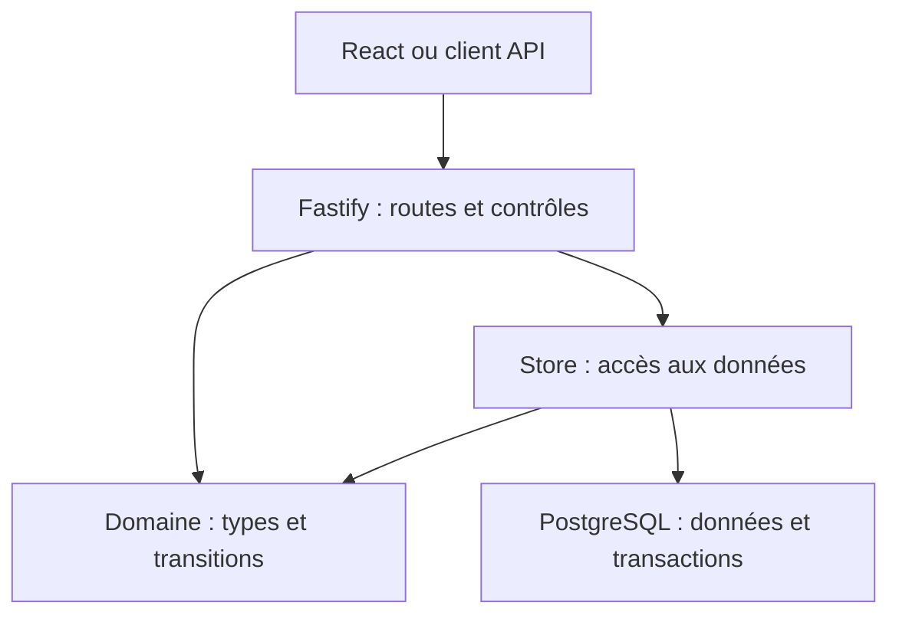
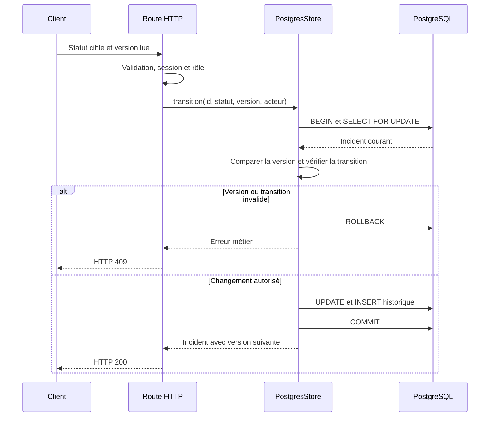
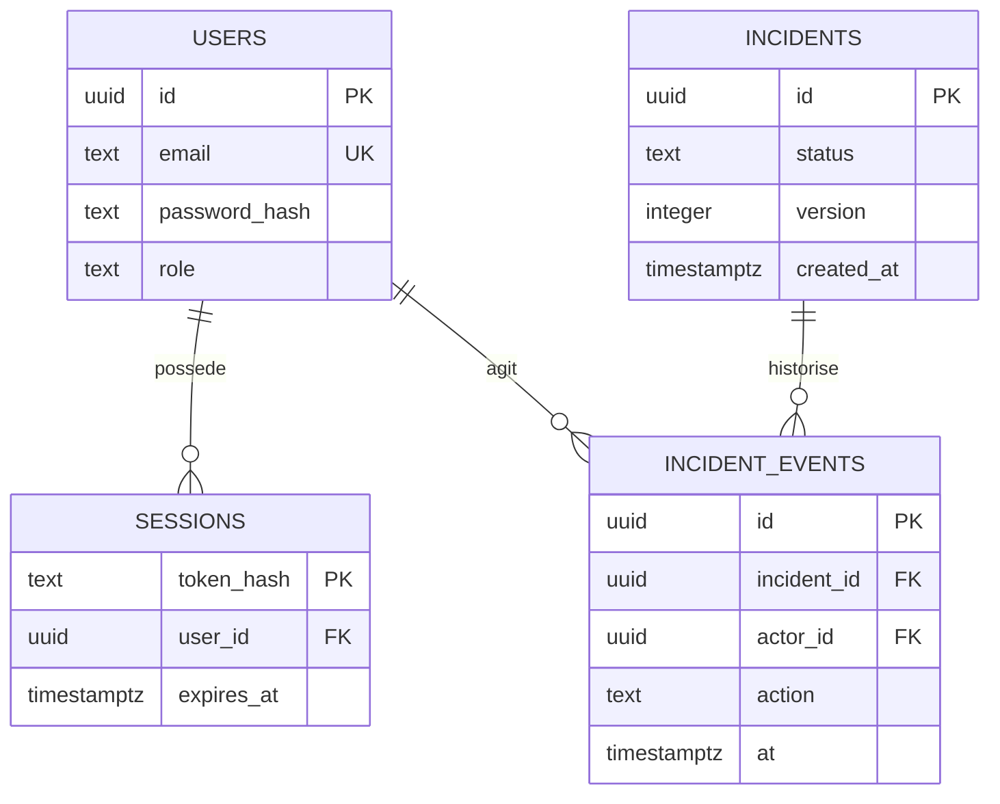
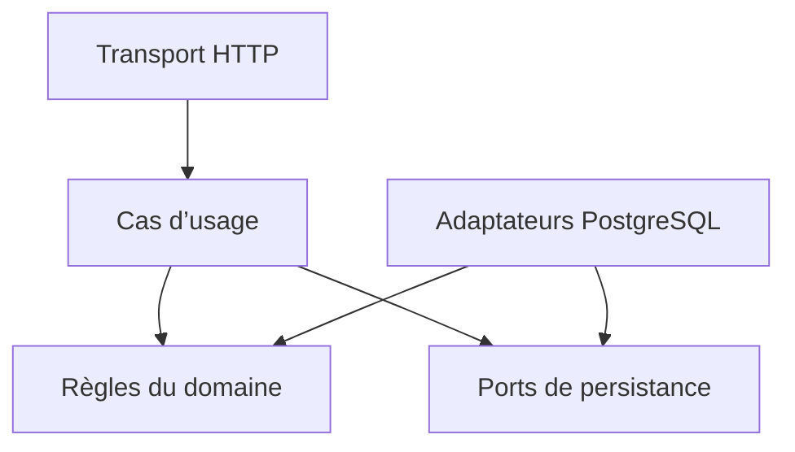

# Architecture d’Incident Desk

Ce guide décrit le code présent sur `main` et les choix qui le structurent. Les évolutions proposées figurent dans une section séparée : elles ne sont pas présentées comme déjà implémentées. Les correctifs de session, d’historique et de Docker local sont suivis dans la [PR #9](https://github.com/anunca/incident-desk/pull/9), indépendante de cette documentation.

## 1. Périmètre et objectifs

Incident Desk est une application pour une équipe unique : déclarer des incidents, modifier leur statut et consulter l’historique. Elle sert aussi de démonstration de développement backend, de concurrence et d’exploitation.

Les objectifs architecturaux sont :

- préserver la cohérence entre un incident et son historique ;
- empêcher un utilisateur de modifier ce que son rôle ne permet pas ;
- rendre les erreurs et conflits explicites ;
- garder un lancement local reproductible et des contrôles automatisés ;
- permettre des évolutions sans imposer une infrastructure distribuée.

Le système n’isole pas plusieurs organisations. Tous les utilisateurs authentifiés accèdent aux mêmes incidents. Il ne fournit pas encore de notifications, de SSO, de pièces jointes ou de traitement asynchrone.

## 2. Vue d’ensemble

L’application est un **monolithe modulaire** : un serveur Fastify expose l’API et sert le bundle React sur la même origine. PostgreSQL conserve les données et les sessions. Aucun service de messages ni cache partagé n’est nécessaire au fonctionnement local.

Les flèches représentent les interactions et dépendances principales. Les règles de transition sont appelées par l’adaptateur PostgreSQL ; il n’existe pas encore de couche de cas d’usage indépendante.

React n’accède jamais à PostgreSQL. Les contrôles côté interface servent à guider l’utilisateur ; le serveur reste responsable de la validation et de l’autorisation.

## 3. Responsabilités et fichiers

| Partie             | Responsabilité actuelle                                      | Point d’entrée                                                                 |
| ------------------ | ------------------------------------------------------------ | ------------------------------------------------------------------------------ |
| Client             | Formulaires, listes, historique et état de l’interface       | [`src/client/App.tsx`](../src/client/App.tsx)                                  |
| Client HTTP        | Appels JSON typés vers l’API                                 | [`src/client/api.ts`](../src/client/api.ts)                                    |
| Assemblage serveur | Plugins, routes, gestion d’erreurs et fichiers statiques     | [`src/server/app.ts`](../src/server/app.ts)                                    |
| Démarrage          | Configuration, pool DB, écoute et arrêt du processus         | [`src/server/main.ts`](../src/server/main.ts)                                  |
| Routes             | Schémas HTTP, contrôles d’accès, réponses et appels au Store | [`src/server/routes/`](../src/server/routes/)                                  |
| Sécurité           | Sessions, rôles, mots de passe, CSRF et headers              | [`src/server/security/`](../src/server/security/)                              |
| Domaine partagé    | Types, contrat Store, erreurs et transitions autorisées      | [`src/shared/domain.ts`](../src/shared/domain.ts)                              |
| Persistance        | SQL paramétré, verrous et transactions                       | [`src/server/persistence/postgres.ts`](../src/server/persistence/postgres.ts)  |
| Observabilité      | Compteurs, latence et labels par modèle de route             | [`src/server/observability.ts`](../src/server/observability.ts)                |
| Migrations         | Schéma versionné et contrôle des migrations appliquées       | [`scripts/migrate.ts`](../scripts/migrate.ts), [`migrations/`](../migrations/) |

`main.ts` construit le pool et injecte `PostgresStore` dans `buildApp`. Les tests HTTP injectent `MemoryStore` à la place. Le domaine ne dépend ni de Fastify ni du pilote PostgreSQL.

Le client importe des **types** depuis `shared` ; il n’importe pas le code serveur de gestion des sessions ou du stockage. Cependant, ce fichier partagé contient encore des contrats internes au backend : sa séparation est une évolution proposée plus bas.

## 4. Lecture et écriture d’un incident

### Lecture

La route valide les paramètres, authentifie la session et demande au Store les incidents ou leur historique. Le tri de la liste utilise `created_at DESC, id DESC`, avec `limit` et `offset` bornés. Le départage par identifiant rend le tri déterministe, mais la pagination ne garantit pas une vue figée si de nouveaux incidents apparaissent entre deux pages.

### Changement de statut

Le client transmet l’identifiant, le statut cible et la version qu’il a lue. Le serveur vérifie le rôle puis ouvre une transaction dans le Store.

Invariants à préserver :

1. Un changement enregistré possède son événement d’historique.
2. Un échec de l’historique annule aussi le changement de l’incident.
3. Une version périmée ne peut pas écraser une modification concurrente.
4. Une transition vers le même statut ou hors du graphe autorisé est refusée.

L’isolation PostgreSQL par défaut est `READ COMMITTED`. Le verrou de ligne sérialise les changements d’un même incident ; la comparaison de version permet d’identifier un client devenu obsolète après l’attente du verrou. Le client doit recharger et décider après un 409, plutôt que remplacer silencieusement sa version et réessayer.

La création est également transactionnelle : incident et événement `created` sont enregistrés ensemble. Elle n’est pas encore idempotente : deux POST peuvent créer deux incidents.

## 5. Modèle de données

Le diagramme expose les colonnes structurantes, pas l’intégralité du schéma. Les contraintes SQL contrôlent notamment rôles, statuts, sévérités, version positive et clés étrangères. Voir la [migration initiale](../migrations/001_initial.sql).

`schema_migrations` conserve le nom, le checksum et la date d’application de chaque migration. Un verrou consultatif PostgreSQL empêche deux processus de migration d’appliquer simultanément le schéma. Une migration déjà appliquée doit rester inchangée ; l’évolution passe par une nouvelle migration.

## 6. Frontières de sécurité

- **Identité** : mots de passe dérivés avec scrypt et sel aléatoire ; tokens de session aléatoires dont seule l’empreinte est stockée en base.
- **Session** : expiration fixe de huit heures et révocation à la déconnexion. Cookie HttpOnly/SameSite Strict pour le navigateur, Bearer pour les clients API.
- **Autorisation** : `reader` consulte ; `operator` et `admin` modifient ; les métriques nécessitent `admin`.
- **HTTP** : validation des entrées, refus des propriétés inconnues, limite du corps, limitation de débit et headers de sécurité.
- **CSRF** : header personnalisé sur les mutations authentifiées par cookie, complété par SameSite et l’absence de CORS ouvert.
- **Données** : SQL paramétré ; erreurs internes génériques ; headers sensibles expurgés des logs.

Le cookie `Secure` doit être activé en production derrière HTTPS. Les paramètres locaux HTTP et ceux de production doivent rester explicites. Le rôle PostgreSQL de démonstration n’est pas une séparation complète des privilèges : en production, distinguer l’utilisateur des migrations et celui de l’application.

L’historique est transactionnel mais n’est pas une preuve inviolable : un administrateur de base peut le modifier. Un besoin de conformité nécessiterait une conservation protégée supplémentaire. Voir le [modèle de menace](../SECURITY.md).

## 7. Build, déploiement et exploitation

| Contexte         | Fonctionnement                                                                      | Limite à connaître                                                    |
| ---------------- | ----------------------------------------------------------------------------------- | --------------------------------------------------------------------- |
| Développement    | Serveur TypeScript surveillé ; esbuild surveille le bundle React                    | Pas de garantie de rechargement automatique du navigateur             |
| Build            | TypeScript compile serveur et domaine dans `dist` ; esbuild produit `public/assets` | Les schémas API ne génèrent pas encore les types client               |
| Docker local     | PostgreSQL, tâche de migration puis application ; volume persistant                 | Identifiants locaux exclusivement destinés au développement           |
| Image            | Build multiétage, dépendances runtime et utilisateur non-root                       | Construire l’image ne prouve pas un parcours navigateur réussi        |
| AWS de référence | ALB HTTPS, deux tâches Fargate privées, secret DB et CloudWatch                     | Réseau, ECR, certificat, DB et migrations sont des prérequis externes |

Le [template AWS](../infra/aws-runtime.yml) décrit le runtime, pas une plateforme autonome déjà déployée. Voir les [prérequis AWS](../infra/README.md).

L’application expose deux sondes distinctes : `live` vérifie la réponse du processus ; `ready` vérifie la connexion DB. La seconde ne vérifie pas l’intégralité du schéma ni le bon fonctionnement d’une opération métier.

Les logs portent un identifiant de requête. Les métriques utilisent des modèles de routes plutôt que des identifiants d’incident pour limiter leur cardinalité. L’endpoint de métriques utilise actuellement une session admin ; une identité machine serait préférable pour un collecteur permanent.

L’arrêt SIGTERM ferme le serveur et le pool avec une limite de temps. Les procédures de sauvegarde, diagnostic et restauration figurent dans le [runbook](runbook.md).

## 8. Vérification des frontières

| Niveau      | Preuve attendue                                 | Couverture actuelle                                               |
| ----------- | ----------------------------------------------- | ----------------------------------------------------------------- |
| Métier      | Transitions et autorisations sans HTTP ni DB    | Vérifiées principalement à travers l’API ; tests isolés à ajouter |
| HTTP        | Validation, sessions, rôles, erreurs et sondes  | Tests Fastify avec `MemoryStore`                                  |
| Persistance | Concurrence, rollback et SQL paramétré          | Tests sur PostgreSQL dédiés                                       |
| Interface   | Session et historique réellement utilisables    | Suite navigateur ajoutée dans la PR #9                            |
| Déploiement | Image exécutable, configuration et restauration | Construction en CI ; validation d’exploitation à compléter        |

Les tests mémoire ne remplacent pas PostgreSQL : les transactions et les verrous doivent être vérifiés avec le moteur réel. Le [workflow CI](../.github/workflows/ci.yml) lance les migrations deux fois, les tests d’intégration, le build et l’audit. Consulter ses résultats pour distinguer les contrôles exécutés des capacités seulement documentées.

## 9. Évolution proposée : cas d’usage et contrats

Cette section est une **cible de refactorisation**, pas la description des modules existants.

| Couche cible   | Responsabilité                                             | Exemples                                   |
| -------------- | ---------------------------------------------------------- | ------------------------------------------ |
| Transport      | Valider l’entrée HTTP et convertir les erreurs en réponses | Routes Fastify, schémas et DTO             |
| Application    | Autoriser et orchestrer une opération                      | `CreateIncident`, `ChangeIncidentStatus`   |
| Domaine        | Définir transitions, invariants et erreurs métier          | Règles indépendantes de HTTP et PostgreSQL |
| Ports          | Décrire les opérations de stockage nécessaires             | `IncidentRepository`, `SessionRepository`  |
| Infrastructure | Implémenter les ports et l’atomicité                       | Adaptateurs PostgreSQL                     |

Les flèches de ce diagramme représentent des dépendances de code : le cas d’usage dépend d’une interface, et l’adaptateur l’implémente. Le serveur assemble les implémentations au démarrage.

**Ne pas casser l’atomicité pendant le découpage.** Séparer un repository d’incident et un repository d’audit, puis appeler deux écritures indépendantes, serait une régression. Les deux opérations doivent partager une même transaction, soit derrière un port atomique explicite, soit derrière une unité de travail réellement implémentée. Le verrou et la vérification de version doivent également rester dans cette frontière transactionnelle.

Plan progressif :

1. Extraire les opérations métier et leurs tests sans changer le contrat HTTP.
2. Séparer les contrats de sessions et d’incidents, en conservant l’atomicité.
3. Isoler les DTO HTTP des types et interfaces internes du domaine.
4. Unifier schémas de validation, réponses et documentation OpenAPI.
5. Regrouper le client par fonctionnalités session/incidents et définir une stratégie explicite d’invalidation du cache.

Critères d’acceptation : un 409 ne modifie aucune donnée ; un échec de l’audit annule l’écriture ; aucun rôle interdit ne peut contourner l’autorisation ; les réponses restent compatibles avec le client ; les tests PostgreSQL et navigateur restent verts.

## 10. Évolutions conditionnées par un besoin

| Besoin concret                       | Évolution à étudier                                                     | Contrepartie                                                         |
| ------------------------------------ | ----------------------------------------------------------------------- | -------------------------------------------------------------------- |
| Notifications fiables                | Outbox enregistrée dans la transaction puis worker avec retries         | Déduplication, supervision et exploitation du worker                 |
| Plusieurs clients isolés             | Modèle d’organisation et filtrage systématique, éventuellement RLS      | Revue des autorisations et tests d’isolation indispensables          |
| Grande volumétrie                    | Pagination par curseur, indexes et analyse des plans SQL                | Nouveau contrat de navigation                                        |
| Deux instances exposées publiquement | Limiteur partagé ou protection en entrée et proxies de confiance précis | Configuration réseau à tester ; pas de confiance globale aux headers |
| Identité d’entreprise                | OIDC/MFA et gestion du cycle de vie des comptes                         | Dépendance au fournisseur et migration des sessions                  |

Ni cache ni microservices ne sont requis par le périmètre actuel. Les ADR permettent de documenter une décision, ses alternatives et le besoin qui la motive.

## Documents associés

- [ADR : sessions opaques](adr/001-sessions.md)
- [ADR : transactions et version](adr/002-consistency.md)
- [Contrat HTTP](api.md)
- [Sécurité](../SECURITY.md)
- [Exploitation](runbook.md)
- [Déploiement AWS](../infra/README.md)
- [Vérification](verification.md)
