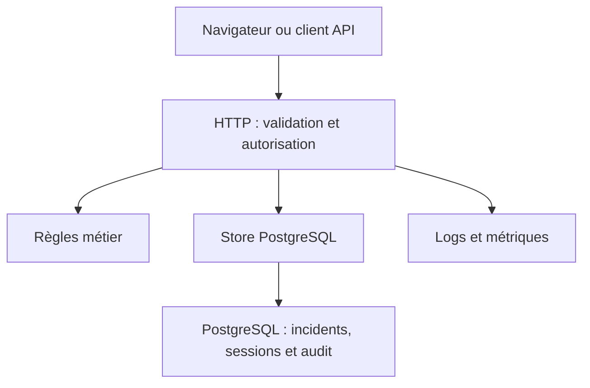

# Architecture

Le code applicatif est regroupé sous `src/` :

- `src/client/` : application React, composants et client API typé ; `main.tsx` monte l’application.
- `src/server/` : API Fastify ; `main.ts` démarre le serveur et `app.ts` assemble ses modules.
- `src/server/routes/` : routes de session, d’incidents, de santé et de métriques.
- `src/server/security/` : authentification, autorisations, mots de passe et headers de sécurité.
- `src/server/persistence/` : stockage PostgreSQL et transactions.
- `src/shared/` : types et règles du domaine partagés ; les imports du client sont uniquement des types.

Le build TypeScript compile le serveur et le domaine dans `dist/`. esbuild compile séparément React dans `public/assets/`, servi par Fastify.

Le domaine n’importe ni Fastify ni PostgreSQL. `Store` permet de tester les comportements HTTP sans base ; les tests PostgreSQL vérifient séparément transactions, contraintes et concurrence. Un monolithe évite la complexité distribuée qui ne serait pas justifiée par ce périmètre.

Une mutation prend un verrou sur la ligne, compare la version transmise, vérifie la transition, puis écrit l’état et l’événement dans la même transaction. Un conflit renvoie 409 : le client doit recharger et décider, sans relance automatique aveugle.

L’interface web utilise React avec TypeScript, sans HTML injecté à partir des données. esbuild produit un bundle local servi par Fastify sur la même origine que l’API. Les modes développement et production utilisent le même point d’entrée ; le bundle et le serveur sont surveillés pendant le développement.

La pagination par offset est bornée et triée avec un identifiant de départage. Elle suffit ici ; elle n’offre pas une vue figée sous insertions concurrentes. Une pagination par curseur serait préférable à grande échelle.
